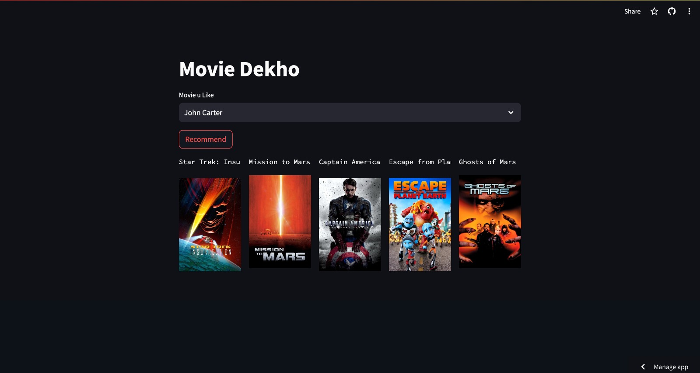
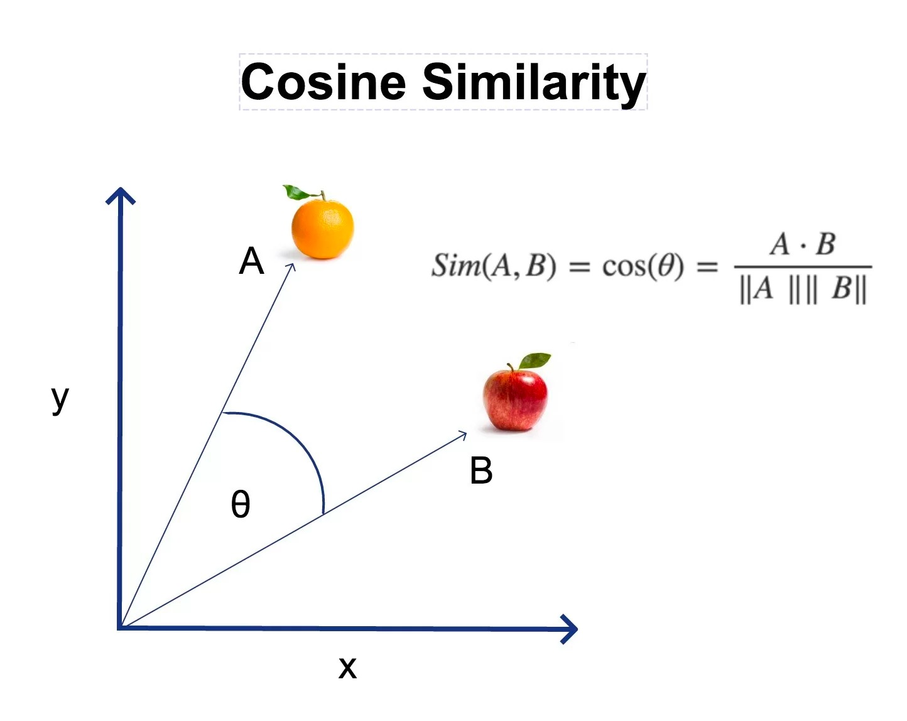

## MOVIE RECOMMENDATION SYSTEM

## Website

[GET ROCOMMENDED](https://movie-recommendation-system-6dsabbtei9kns3qby52xwx.streamlit.app/)

## DataSet Used

The dataset used in this project contains information on 5000 movies, including various details such as genre, cast, crew, and more. This dataset serves as the foundation for the analysis helps in building recommendation system

## Types of Recommendation Systems

In this project, we utilize Content-Based Filtering recommendation systems to provide personalized recommendations to users. 
The main types of recommendation systems implemented are:

1. **Content-Based Filtering:**
  Content-based filtering methods are based on the description of a product and a profile of the user’s preferred choices. In this recommendation system, products are described using keywords, and a user profile is built to express the kind of item this user likes.
**For instance, if a user likes to watch movies such as Iron Man, the recommender system recommends movies of the superhero genre or films describing Tony Stark.**

   
3. **Collaborative Filtering:**
The collaborative filtering method is based on gathering and analyzing data on user’s behavior. This includes the user’s online activities and predicting what they will like based on the similarity with other users.For example, if user A likes Apple, Banana, and Mango while user B likes Apple, Banana, and Jackfruit, they have similar interests. So, it is highly likely that A would like Jackfruit and B would enjoy Mango. This is how collaborative filtering takes place.
Two kinds of collaborative filtering techniques used are:

  User-User collaborative filtering
  Item-Item collaborative filtering
  
   
3. **Hybrid Recommendation Systems:**
 In hybrid recommendation systems, products are recommended using both content-based and collaborative filtering simultaneously to suggest a broader range of products to customers. This recommendation system is up-and-coming and is said to provide more accurate recommendations than other recommender systems.

## Cosine Similarity

Cosine similarity is a metric used to measure the similarity between two vectors in a multi-dimensional space. It calculates the cosine of the angle between these vectors, which is a measure of how closely they align with each other. for better understanding , please refer

### Applications

Cosine similarity finds applications in various fields, including:

- **Natural Language Processing (NLP):** In text analysis, documents can be represented as vectors of word frequencies or embeddings. Cosine similarity is used to measure the similarity between documents, enabling tasks such as document clustering, information retrieval, and document similarity ranking.

- **Information Retrieval:** Cosine similarity is utilized in search engines to match user queries with relevant documents. By computing the similarity between the query vector and document vectors, search engines can rank documents based on their relevance to the query.

- **Recommendation Systems:** In collaborative filtering recommendation systems, user-item interactions are represented as vectors. Cosine similarity is employed to find similar users or items based on their interaction vectors, enabling personalized recommendations.

- **Image Processing:** Cosine similarity can be applied to compare image features extracted using techniques like Convolutional Neural Networks (CNNs). It helps in tasks such as image retrieval and content-based image recommendation.

